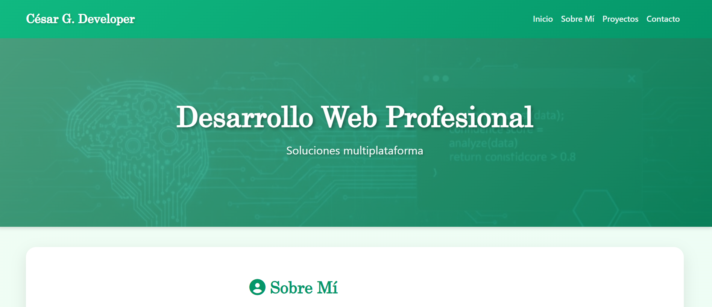
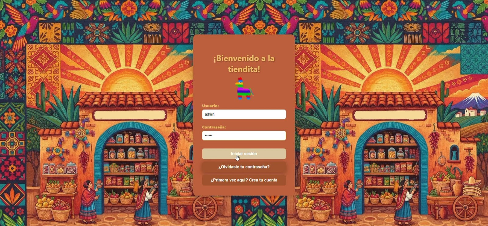
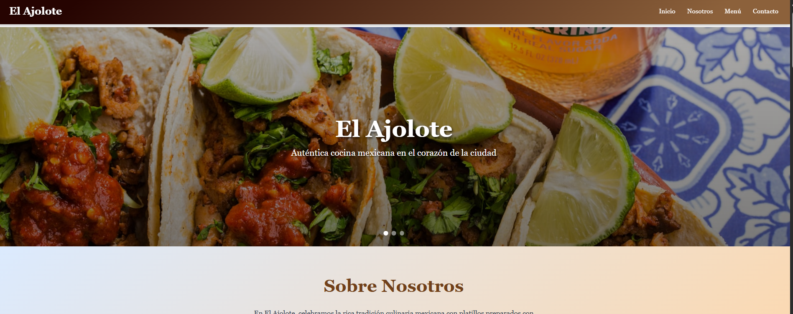

# 🌐 Personal Portfolio | Portafolio Personal

## 📌 About the Project | Sobre el Proyecto

### 🇺🇸 English

This is my personal portfolio website developed to showcase who I am, my technical skills, and the projects I have built.

The portfolio includes information about me, my technologies, and examples of web applications I have developed.

Current featured projects:

* 🛒 Grocery Store E-commerce (demo)
* 🍽️ Restaurant Website with menu and location information

This project was built focusing on creating modern, responsive, and maintainable web applications.

---

### 🇲🇽 Español

Este es mi sitio web de portafolio personal desarrollado para mostrar quién soy, mis habilidades técnicas y los proyectos que he construido.

El portafolio incluye información sobre mí, las tecnologías que utilizo y ejemplos de aplicaciones web desarrolladas.

Proyectos destacados actualmente:

* 🛒 Ecommerce de abarrotes (demo)
* 🍽️ Página web para restaurante con menú e información de ubicación

Este proyecto fue desarrollado con enfoque en crear aplicaciones modernas, responsivas y mantenibles.


---

# 🚀 Technologies Used | Tecnologías Utilizadas

### Backend

* PHP
* Laravel

### Frontend

* React
* JavaScript
* HTML5
* CSS3
* Bootstrap

### Database

* MySQL

---

# 📂 Featured Projects | Proyectos Destacados

## 🛒 Grocery Store E-commerce (Demo)

### 🇺🇸 English

A sample e-commerce platform designed for grocery shopping. Includes product browsing, responsive design, and database integration.

### 🇪🇸 Español

Plataforma de comercio electrónico de ejemplo enfocada en venta de abarrotes. Incluye exploración de productos, diseño responsivo e integración con base de datos.

---

## 🍽️ Restaurant Website

### 🇺🇸 English

A restaurant website that displays menu information, business details, and location.

### 🇪🇸 Español

Sitio web para restaurante que muestra el menú, información del negocio y ubicación.

---

# ⚙️ Installation | Instalación

### Clone repository

```bash
git clone https://github.com/YOUR_USERNAME/YOUR_REPOSITORY.git
```

### Enter project directory

```bash
cd YOUR_REPOSITORY
```

### Install dependencies

```bash
composer install
npm install
```

### Configure environment

```bash
cp .env.example .env
php artisan key:generate
```

### Configure database

Update your `.env` file with MySQL credentials.

### Run application

```bash
php artisan serve
npm run dev
```

Open:

```bash
http://127.0.0.1:8000/
```

---

# 📸 Screenshots

<h2>Home</h2>


<h2>Store</h2>


<h2>Restaurant</h2>



# 👨‍💻 Author | Autor

**Cesar Luis García Cruz**

GitHub:
https://github.com/CesarLuisGarciaCruz

LinkedIn:
www.linkedin.com/in/cesar-luis-g-702a3824a

---

⭐ If you like this project, feel free to give it a star.
